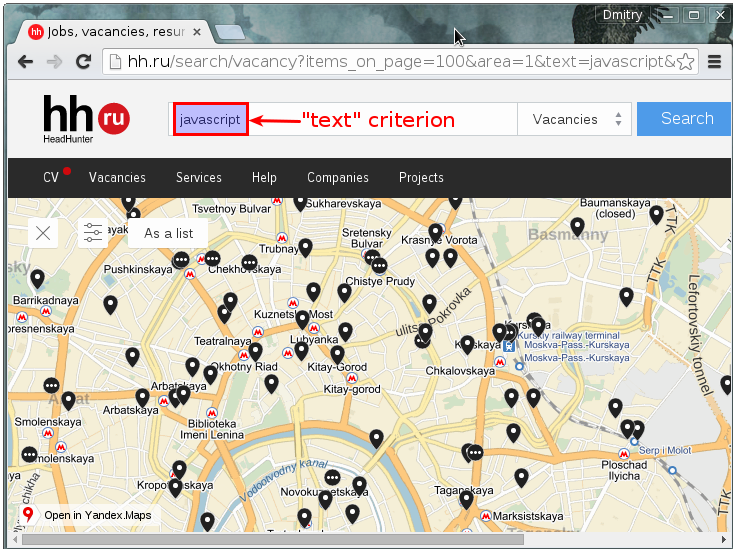
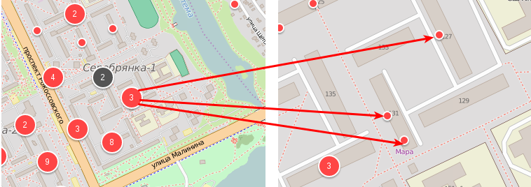

# JS-developer test task

**IMPORTANT NOTICE:**

* Please, send an [email](mailto:hr@upsilonit.com) with an ETA, if you are
  willing to complete this test task.

* If you consider this task to be too large you can complete only a part of it.

* You should push the completed task to a GitHub or Bitbucket repository.

**Tools:**

1. Use **AngularJS** as a base framework for the frontend
   ([https://angularjs.org/](https://angularjs.org/))
2. Use angular **Leaflet** with GoogleMaps provider
   ([https://github.com/tombatossals/angular-leaflet-directive](https://github.com/tombatossals/angular-leaflet-directive)).

3. Use **Bootstrap** as a components library
   ([http://getbootstrap.com/](http://getbootstrap.com/)).

4. Use **Grunt** or **Gulp** as a builder
   ([http://gruntjs.com/](http://gruntjs.com/) or
   [http://gulpjs.com/](http://gulpjs.com/)).
5. Use **Bower** to manage dependencies ([http://bower.io/](http://bower.io/)).

**Task Definition:**

You have to create a web-page which displays on the map (with the help of
markers) all available vacancies by the user-defined search criteria. (refer to
pic. 1)

pic. 1 Example of a web - page that should be implemented.

(Click
[here](http://hh.ru/search/vacancy?items_on_page=100&area=1&text=javascript&label=with_address&enable_snippets=true&clusters=true&salary=&isMap=true&bottom_left_lat=55.72690568198101&bottom_left_lng=37.490116014513234&top_right_lat=55.76466883573002&top_right_lng=37.819705858263234)
for a real - world example)

_Nice to have:_

_While using the markers to display the available vacancies it’s nice to have a
grouping of them. That means that the markers should not overlap each other on
zoom. The overlapping vacancies should be displayed as one marker with the info
like "n-vacancies here". _

_(refer to pic. 2)_

pic. 2 Example of a split-on-zoom functionality

([https://r.onliner.by/pk](https://r.onliner.by/pk)).

**Presentation:**

The page should contain a map to display results. On the startup the map is
pointed to Minsk, Belarus. The user should be able to move the boundaries of the
map and the result on the map should be updated.

The page should also contain a set of fields that will be used as a search
criteria for user-defined search (names and values
[are described](https://github.com/hhru/api/blob/master/docs/vacancies.md#search)
within the REST API documentation):

* text (simple text with no request syntax. That one is contained within the
  screenshot) (pic.1)

* experience

* employment

* schedule

* currency

* salary

* [optional] any other from the
  [list](https://github.com/hhru/api/blob/master/docs/vacancies.md#search)

**Datasource:**

As a datasource you should use the [public API](https://dev.hh.ru/) of hh.ru
company. It’s fully documented.

**Use the public part with no OAuth.**

You should use the values of the search criteria fields from presentation layer
here to execute a REST API request.

Example of REST API request:
http://hh.ru/shards/searchvacancymap?items_on_page=100&&enable_snippets=true&label=with_address&text=javascript&clusters=true&salary=&isMap=true&bottom_left_lat=53.698611658494&bottom_left_lng=26.308946708060958&top_right_lat=54.02979493800219&top_right_lng=28.616075614310958&_=1448885030019

(Names and values
[are described](https://github.com/hhru/api/blob/master/docs/vacancies.md#search)
within the REST API documentation)
